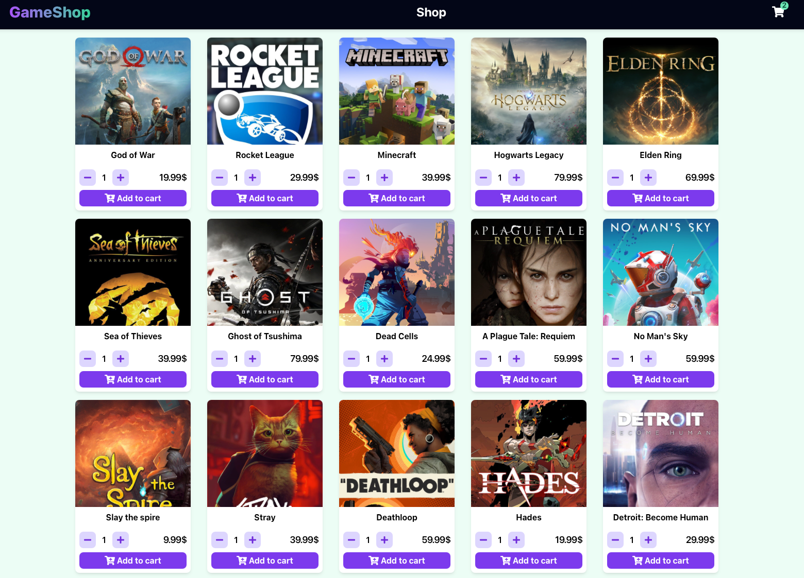
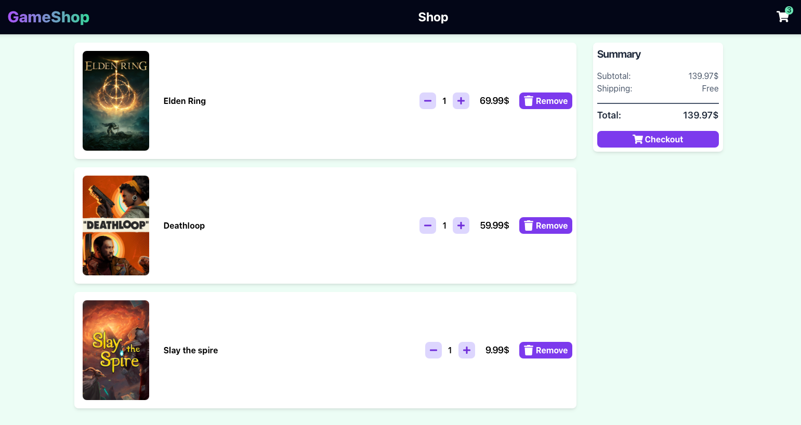
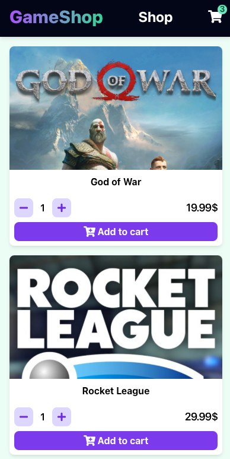

# GameShop (Shopping Cart Project)

<p align="center">
  
  <a href="https://github.com/insomniac2305/shopping-cart/graphs/commit-activity" target="_blank"></a>
  
  <a href="https://github.com/insomniac2305/shopping-cart/blob/master/LICENSE" target="_blank"></a>
</p>

## Overview

GameShop is a simple shopping cart application that allows users to browse video games, add them to a cart, and proceed to a dummy checkout. The application features a clean, modern UI with dark mode support and is fully responsive across devices. <br/> <br/>
This project is part of [The Odin Project's curriculum](https://www.theodinproject.com/) and was built to practice building a React single-page-application with browser navigation and writing tests for UI components. It was also the first project I built using TailwindCSS for component styling.

<p align="center">
  
</p>

<details>
  <summary>Cart screenshot</summary>
  <p align="center">
    
  </p>
</details>

<details>
  <summary>Mobile screenshot</summary>
  <p align="center">
    
  </p>
</details>

## Features

- 🏠 Homepage with routing to Shop and Cart pages
- 🛒 Shopping cart functionality (add, adjust quantity, remove items)
- 🖼️ Modal views for detailed product information
- 📱 Fully responsive design across all device sizes
- 🌙 Dark mode support (follows system preferences)

## Technologies

- **React** - Front-end library
- **React Router** - Navigation and routing
- **TailwindCSS** - Utility-first CSS framework
- **Jest** - Testing framework

## Setup Instructions

1. Clone the repository:

   ```
   git clone https://github.com/insomniac2305/shopping-cart.git
   cd gameshop
   ```

2. Install dependencies:

   ```
   npm install
   ```

3. Start the development server:

   ```
   npm start
   ```

4. Open your browser and visit:
   ```
   http://localhost:3000
   ```

## Build & Deploy

```
npm run build
```

The application is configured for GitHub Pages deployment:

```
npm run deploy
```

## Running Tests

```
npm test
```

## License

This project is [GPL-3.0](https://github.com/insomniac2305/shopping-cart/blob/master/LICENSE) licensed.
